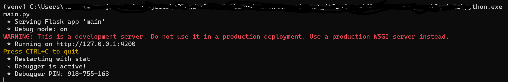
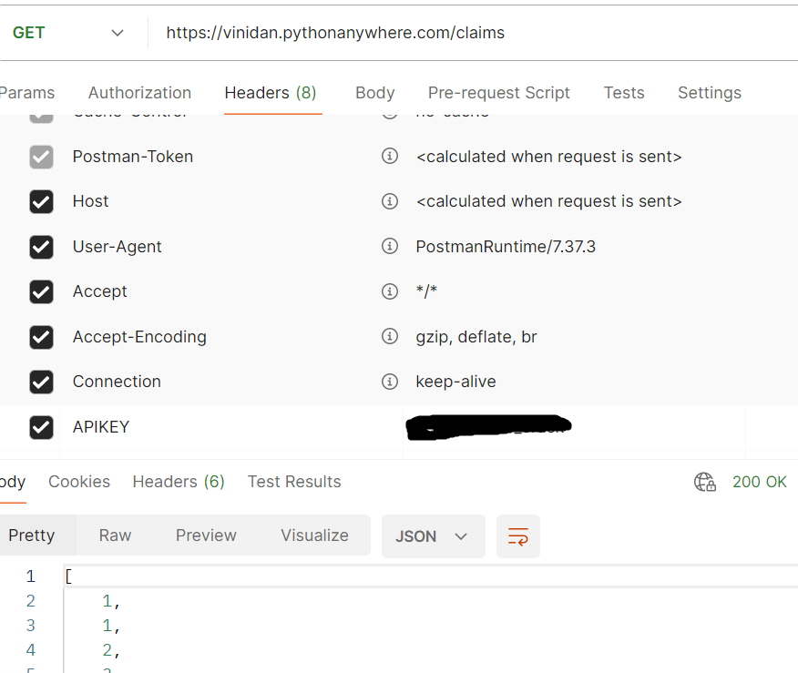
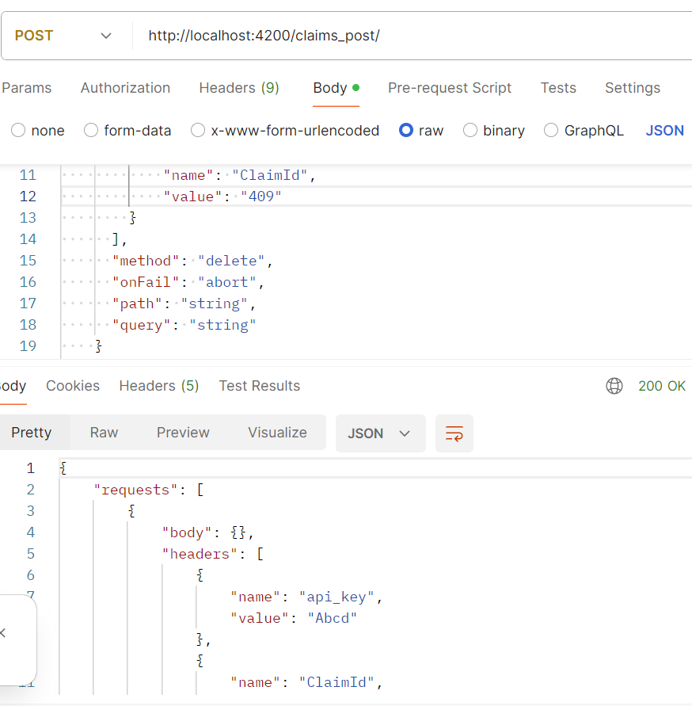

# APIUnderTest

** Use cloud version from here ** 
* baseURL https://vinidan.pythonanywhere.com/
* method get https://vinidan.pythonanywhere.com/claims
* method post https://vinidan.pythonanywhere.com/claims_post/ 

## _OR_

** Set up application under test in local **

* baseURL http://localhost:8080/
* method get http://localhost:8080/claims
* method post http://localhost:8080/claims_post/

_Note: 8080 is the port of the application_

[//]: # (Setting up Application UnderTest)
[//]: # (1. clone the repository)
1. Create a folder in your computer and clone repo
`    git clone https://github.com/vinitad12/APIUnderTest.git
`
2. create virtual environment in the same folder where you have cloned repo
`    python -m venv <name>
`
3. Once env created activate it (windows)
`   <venv>\Scripts\activate.bat 
`

4. python is installed in venu 
`pip list
`

5. install required dependencies in venv 
`    pip install flask
`

`    pip install rpds-py==0.18.0
`
`    pip install jsonschema==4.22.0
`
6. once all dependencies are installed
`   pip list 
`

7. spin the server 
`   python main.py
`

**API CALLS - get and post Screenshots**
_from cloud version_

_from localhost_

