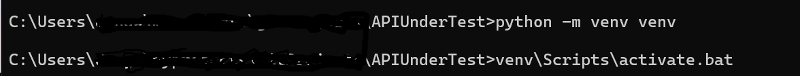
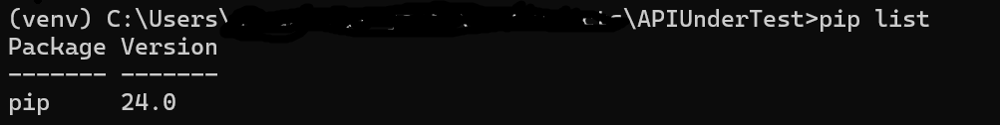
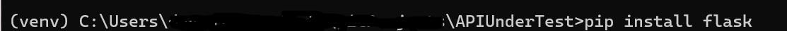
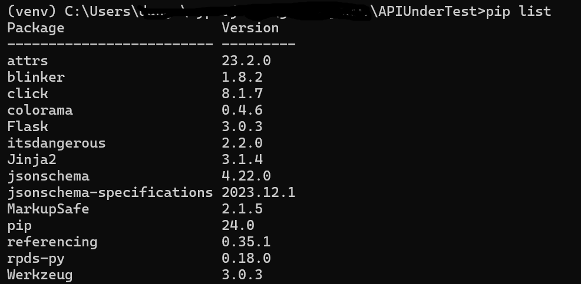

# APIUnderTest

[//]: # (Setting up Application UnderTest)
1. clone the repository 
2. create virtual environment in the same folder where you have cloned repo
    python -m venv <name>
3. Once env created activate it
   <venv>\Scripts\activate.bat 

python is installed in venu 

4. install required dependencies in venv 
    pip install flash

    pip install rpds-py==0.18.0
    pip install jsonschema==4.22.0
5. once all dependencies are installed
   pip list 

6. spin the server - python main.py

